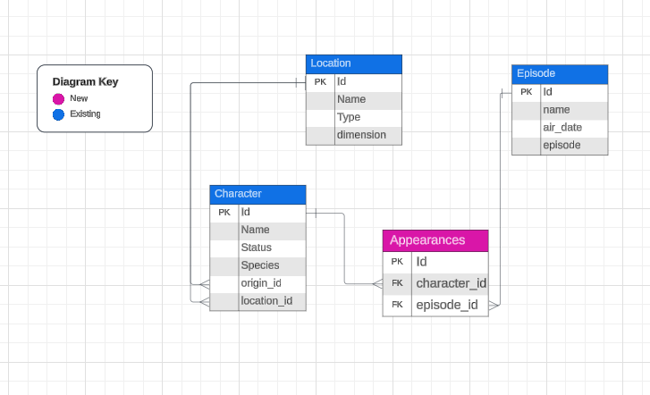
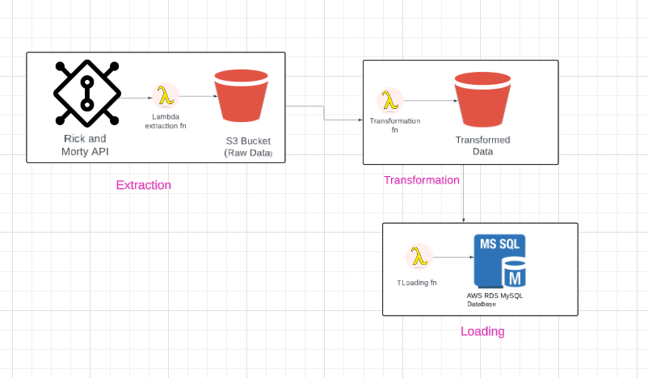

# Data Engineering on AWS Masterclass

This project demonstrates my journey through the **Data Engineering with AWS Masterclass**, where I applied key data engineering skills to power an analytics workload on AWS. I worked on creating Lambda functions, using S3 buckets for staging, and setting up an RDS instance to connect to a database, showcasing a complete ETL pipeline from data ingestion to transformation and loading.

The project centers on extracting data from the **Rick and Morty series API**, performing necessary transformations, and loading the processed data into a MySQL database hosted on AWS RDS.

Link to API: https://rickandmortyapi.com/api

There are currently three available resources:

Character: used to get all the characters.
Location: used to get all the locations.
Episode: used to get all the episodes.

### Entity Relational Diagram

## Key Learning Outcomes

1. Designing and architecting a real-world data platform on AWS.
2. Building and deploying Lambda functions for ETL tasks.
3. Working with AWS S3 for data staging and storage.
4. Setting up a MySQL database on AWS RDS.
5. Automating jobs using AWS EventBridge.
6. Connecting to and running SQL queries from the modeled data warehouse.

---

## Workload Breakdown

### Data Flow Diagram

### 1. Data Ingestion

**Objective**: Ingest data from the **Rick and Morty API** in near real-time using lightweight compute resources. I utilized AWS Lambda for serverless computing to handle Python-based ETL tasks.

- **AWS Lambda**: Created Lambda functions to extract data and interact with other AWS services like S3 and RDS.
- **Data Staging**: Stored the raw data in an S3 bucket for the transformation step.

### 2. Transformation and Loading

I learned to automate the process of transforming the ingested data using Lambda functions and storing it back into S3. I then loaded the transformed data into MySQL tables on AWS RDS. By connecting all these steps via EventBridge, I could trigger the ETL pipeline in a structured and efficient manner.

### 3. AWS Architecture

The architecture involves:
- **Lambda for ETL**: Three Lambda functions handle the extraction, transformation, and loading.
- **S3 for Data Staging**: S3 stores raw and processed data at different pipeline stages.
- **MySQL RDS**: Used MySQL as the data warehouse for final storage.
- **EventBridge for Scheduling**: AWS EventBridge is used to automate and schedule the pipeline.

---

## Setup Steps

### 1. AWS Lambda Functions

I set up multiple Lambda functions for this project, each handling a different stage of the ETL process.

- **Extraction Lambda**: Extracted data from the API and saved it to an S3 bucket.
  - Used Python libraries like Pandas and requests for API interaction.
- **Transformation Lambda**: Applied transformations to the raw data stored in S3 and saved the processed data back to S3.
- **Loading Lambda**: Loaded the processed data into MySQL tables hosted on AWS RDS.

**Lambda Configuration**:
- **Runtime**: Python 3.12
- **Permissions**: Lambda execution role with **AmazonS3FullAccess** policy.
- **Layer**: Added AWSSDKPandas layer for data wrangling.
- **Timeout**: Increased to 15 minutes to handle data processing without errors.

### 2. S3 Bucket Setup

S3 was used as the staging area for the ETL process:
- Created a unique S3 bucket and enabled versioning.
- Set appropriate security policies, including server-side encryption (SSE-S3).

### 3. RDS Database Setup

RDS was used to simulate a data warehouse:
- **Engine**: MySQL (Free Tier)
- **Instance**: db.t2.micro (20 GiB SSD)
- Configured VPC security groups and inbound rules to allow MySQL connection from my IP address.

---

## Testing the Pipeline

I tested the ETL pipeline at each stage by invoking Lambda functions individually and validating the flow of data from API to MySQL RDS.

1. **Extract**: Verified API data extraction and storage in S3.
2. **Transform**: Checked transformations applied to data in S3.
3. **Load**: Confirmed that transformed data was correctly loaded into the MySQL database on RDS.

---

This project not only solidified my understanding of AWS services like Lambda, S3, and RDS but also gave me hands-on experience in building and automating a data engineering pipeline. Through this masterclass, I learned how to structure an ETL pipeline, manage AWS infrastructure, and schedule processes using EventBridge.
